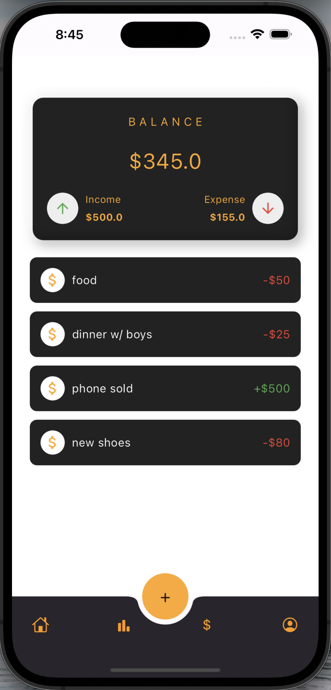
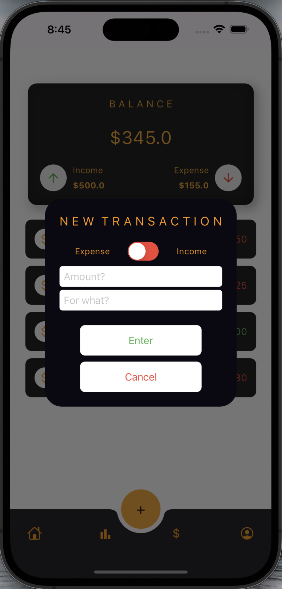

# Insight tho 📊💰
### A Flutter app to easily track your expeses and gain insights
### "making budgeting and financial management a breeze!"

[](https://github.com/eliazonta/insight-tho/stargazers)
[](https://github.com/eliazonta/insight-tho/network)
[](https://github.com/eliazonta/insight-tho/issues)
[](https://github.com/eliazonta/insight-tho/blob/main/LICENSE)

[](CONTRIBUTING.md)

## Features

- Track your expenses and get an overall summary
- Retrieve a [Google Sheets](https://www.google.com/sheets/about/) spreadsheet in real time
- [WIP] Track your daily, weekly, and monthly expenses. 
- Categorize your expenses for better insights.
- [WIP] Visualize your spending patterns through charts and graphs.
- [WIP] Set budget goals and receive notifications when exceeded.

## Screenshots
|Home Screen |New Transaction|
|--|--|
|  |  |


## Installation

1. Clone the repository:

```bash
git clone https://github.com/eliazonta/insight-tho.git
```
2. Navigate to the project directory:

```bash
cd insight-tho
```

3. Install dependencies:

```bash
flutter pub get
```

4. Run the app:

```bash
flutter run
```

## Contributing 
Contributions are welcome! Please check out the [Contribution Guidelines](CONTRIBUTING.md).

## License
The project is under the [MIT License](LICENSE.md).

## Support
If you have any questions, issues, or feature requests, feel free to create an issue.

Happy budgeting with Insight Tho! 🚀